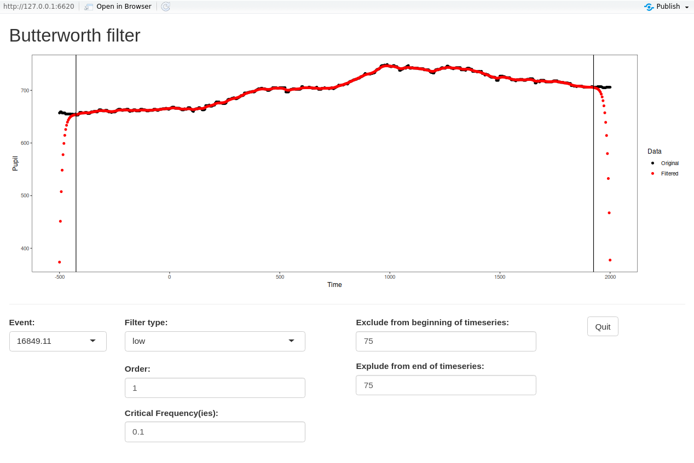

```{r global_options, include=FALSE}
knitr::opts_chunk$set(fig.width=6, fig.height=4, warning=FALSE)
```

```{r, echo=FALSE, eval=TRUE, message=FALSE, results='hide'}
library(PupilPre)
library(ggplot2)
data(Pupilex4)
dat <- clean_artifact(Pupilex4, MADWindow = 100, MADConstant = 2,
                      MADPadding = c(200, 200), MahaConstant = 2,
                      Method = "Robust", XandY = TRUE, Second = T, 
                      MaxValueRun = 5, NAsAroundRun = c(2,2),
                      LogFile = paste0(tempdir(),"/ArtifactCleanupLog.rds"))
UserCleanupLog <- vector("list", length = length(unique(dat$Event)))
names(UserCleanupLog) <- unique(dat$Event)
UserCleanupLog[1:length(UserCleanupLog)] <- NA
UserCleanupLog[["16892.8"]] <- c(1835:1995)
saveRDS(UserCleanupLog, file = paste0(tempdir(),"/UserCleanupLog.rds"))
dat <- apply_user_cleanup(dat, LogFile = paste0(tempdir(),"/UserCleanupLog.rds"))
# saveRDS(dat, file = "Partial_datclean.rds", compress = "xz")
# This is the same as dat5 within the basic processing
```

This vignette contains detailed information regarding optional steps in the preprocessing pipeline, namely, interpolation of missing data and filtering. 
These are presented sequentially, because in order for the filter to be carried out appropriately, it is necessary to ensure each event is not missing data.


## Interpolation

Once cleaning is done, it is possible to interpolate the missing values, if desired.  
Currently the function `interpolate_NAs` uses either linear interpolation or cubic spline interpolation as implemented in the package [zoo](https://cran.r-project.org/package=zoo). 
It is also possible to interpolate the X and Y gaze coordinates, if needed for the analysis, by setting `XandY` to `TRUE`.
By default, this function requires a minimum of two data points in the event in order to carry out the interpolation (else the function may fail).
Futher, please note that if the missing values occur at the beginning or the end of the time series, the missing data cannot be interpolated as there is no beginning (or end) value between which to interpolate.

### Linear

```{r, eval=TRUE, echo=TRUE, results='asis'}
datlinear <- interpolate_NAs(dat, Method = "linear", XandY = T, MinData = 2)
```

```{r, eval= TRUE, echo=FALSE, results='asis'}
# Plot example
pac_theme <- function(base_size = 12, base_family = ""){
  theme_bw(base_size = base_size, base_family = base_family) %+replace%
    theme(panel.grid.major.x = element_blank(),
          panel.grid.minor.x = element_blank(),
          panel.grid.major.y = element_blank(),
          panel.grid.minor.y = element_blank(),
          plot.title = element_text(hjust = 0.5, vjust = 1)
    )
}
datlinear %>% filter(Event %in% c("16849.39")) %>% 
  select(Event, Pupil, Time) %>%
  tidyr::gather(Column, PUPIL, -Time, -Event) %>% 
  ggplot(aes(x=Time, y=PUPIL)) + 
  geom_point(na.rm = T) +
  ylab("Pupil Dilation") +
  facet_wrap(. ~ Event) + pac_theme()
```

### Splines

```{r, eval=TRUE, echo=TRUE, results='asis'}
datspline <- interpolate_NAs(dat, Method = "spline", XandY = T, MinData = 2)
```

```{r, eval= TRUE, echo=FALSE, results='asis'}
# Plot example
pac_theme <- function(base_size = 12, base_family = ""){
  theme_bw(base_size = base_size, base_family = base_family) %+replace%
    theme(panel.grid.major.x = element_blank(),
          panel.grid.minor.x = element_blank(),
          panel.grid.major.y = element_blank(),
          panel.grid.minor.y = element_blank(),
          plot.title = element_text(hjust = 0.5, vjust = 1)
    )
}
datspline %>% filter(Event %in% c("16849.39")) %>% 
  select(Event, Pupil, Time) %>%
  tidyr::gather(Column, PUPIL, -Time, -Event) %>% 
  ggplot(aes(x=Time, y=PUPIL)) + 
  geom_point(na.rm = T) +
  ylab("Pupil Dilation") +
  facet_wrap(. ~ Event) + pac_theme()
```

Again, the function `plot_compare_app` can be useful in visualizing the effect of the interpolation.

## Filtering

Once interpolation is done, it is possible to filter the data, if desired.  
Currently a Butterworth filter is available as is implemented in the function `butter` in the package [signal](https://cran.r-project.org/package=signal).
The filter allows for low-pass, high-pass, stop-band (band-reject), or pass-band filtering.

### Determining the parameters

The filter requires a number of parameters be set: n (the filter order, i.e., integer value), W (the critical frequency(ies) of the filter, i.e., the cut-off frequencies between 0 and 1 where 1 is the Nyquist frequency), and type (the filter type, e.g., "low", etc.).
In this example, we will use a data set containing linear interpolation.

```{r, eval=FALSE, echo=TRUE, results='asis'}
butter_filter_app(datlinear)
```

<style>
im {
width: 100%;
text-align: center;
}
</style>

<div id='im'>
  
</div>

In addition to the parameters of the filter, there are inputs for excluding a specific number of milliseconds from the beginning and the end of the timeseries.  
This is included as the user will notice that the filter can create artifacts at the edges.
These inputs place vertical bars to aide the use in later decisions regarding data trimming.

### Applying the filter

Once the parameters have been selected, it is necessary to apply the filter to the data, using the function `apply_butter`.

```{r, eval=TRUE, echo=TRUE, results='asis'}
datfilter <- apply_butter(datlinear, n = 1, W = 0.1, type = "low", plane = "z")
```

Notice that the function outputs a summary of how many events were filtered and how many were skipped due to the presence of missing data.
These skipped events can easily be removed from the data using the function below.

### Trimming the data

The function `trim_filtered` allows the user to quickly remove both skipped events as well as artifacts created by the filter.
As noted above, the filter skips events that contained missing values.
These skipped events can be removed by setting `RmSkipped` to `TRUE`.
As noticed when using the function `plot_filter_app`, the filter can create artifacts at the edges of the timeseries.
These artifacts can be removed from the data by providing `RmEdges` with the number of milliseconds to remove from the beginning of the timeseries (i.e., the first number in the vector), and from the end of the timeseries (i.e., the second number in the vector).

```{r, eval=TRUE, echo=TRUE, results='asis'}
dattrim <- trim_filtered(data = datfilter, RmSkipped = TRUE, RmEdges = c(75, 75))
```

## Proceed with preprocessing

At this point it is possible to proceed with preprocessing as usual. 
Please refer back to the [Basic Preprocessing](PupilPre_Basic_Preprocessing.html) vignette and continue by performing baseline correction.

