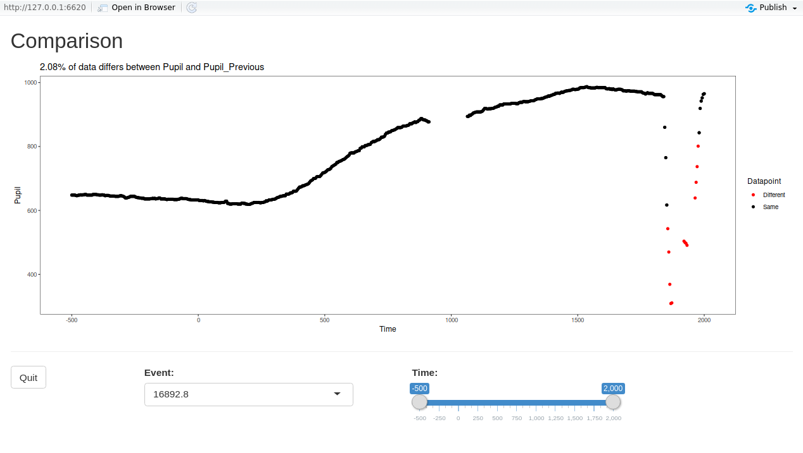
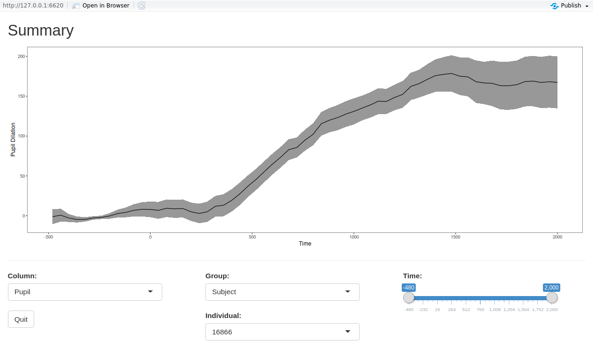

```{r global_options, include=FALSE}
library(ggplot2)
library(gridExtra)

knitr::opts_chunk$set(fig.width=6, fig.height=4, fig.align="center", warning=FALSE)
```

```{r, eval = TRUE, echo=FALSE, results='hide', message=FALSE}
library(PupilPre)
# Load some proccessed data
data(Pupilex7)
dat <- Pupilex7
```

## Plotting the data

It is often desirable to visualize the preprocessed data, either as a grand average or by condition.
In some cases it is even necessary to visualize the trend in the data over a continuous predictor. 
So, the functions `ppl_plot_avg` and `ppl_plot_avg_contour` provide straightforward plotting options for such cases.
These functions internally calculate the average(s) and plot the results.
The plotting is powered by `ggplot2`, so further customization (plot titles, custom themes, etc.) is still possible.
For more information about [ggplot2](http://ggplot2.tidyverse.org/reference/), please refer to its reference manual and extensive documentation.

### Averaged data

Using the function `ppl_plot_avg`, it is possible to plot the overall average of the data. 
In `Column` simply put the column containing the pupil size data

```{r, eval= TRUE, fig.show='hold', results='asis', message=FALSE}
ppl_plot_avg(data = dat, xlim = c(0, 2000), Column = "Pupil",
             Condition1 = NULL, Condition2 = NULL, Cond1Labels = NA, 
             Cond2Labels = NA, ErrorBar = TRUE, PupilPreTheme = TRUE) 
```

To add a title to the plot, simply add the title function from `ggplot2`.

```{r, eval= TRUE, fig.show='hold', results='asis', message=FALSE}
ppl_plot_avg(data = dat, xlim = c(0, 2000), Column = "Pupil",
             Condition1 = NULL, Condition2 = NULL, Cond1Labels = NA, 
             Cond2Labels = NA, ErrorBar = TRUE, PupilPreTheme = TRUE) + 
  ggtitle("Averaged Data")
```

To customize the appearance of a plot (e.g., font, size, color, margins, etc.), the `PupilPreTheme` parameter can be set to `FALSE`, which reverts to the default theming in `gglpot2`. 
In this way, the user can apply a custom theme to the plot. 
Detailed information about creating themes can be found at [ggplot2 Theme Vignette](http://ggplot2.tidyverse.org/reference/theme.html).
For the purpose of illustration, the default ggplot2 theme has been applied, with the axis text elements increased in size.

```{r, eval= TRUE, fig.show='hold', results='asis', message=FALSE}
ppl_plot_avg(data = dat, xlim = c(0, 2000), Column = "Pupil",
             Condition1 = NULL, Condition2 = NULL, Cond1Labels = NA, Cond2Labels = NA,
             ErrorBar = TRUE, PupilPreTheme = FALSE) + 
  theme(axis.text = element_text(size = 15))
``` 


### Conditional averages

The function `ppl_plot_avg` can also be used to plot averages for different conditions, based on a factor variable in the data.
If the current factor level labels are not suitable for plotting, specify new labels using a list in `Cond1Labels`. 
This will add curves for all levels in a single plot.

```{r, eval= TRUE, fig.show='hold', fig.height=5, results='asis', message=FALSE}
ppl_plot_avg(data = dat, xlim = c(0, 2000), Column = "Pupil", 
             Condition1 = "talker", Condition2 = NULL, 
             Cond1Labels = c(CH1 = "Chinese 1", CH8 = "Chinese 3",
                             CH9 = "Chinese 2", CH2 = "Chinese 4", EN3 = "English 1"),
             Cond2Labels = NA, ErrorBar = TRUE, PupilPreTheme = TRUE)
```

For a 2x2 design, it is possible to specify both conditions. 
This will create the interaction of the two conditions and plot all combinations in a single plot

```{r, eval= TRUE, fig.show='hold', fig.width=7, fig.height=5, results='asis', message=FALSE}
ppl_plot_avg(data = dat, xlim = c(0, 2000), Column = "Pupil", 
             Condition1 = "talker", Condition2 = "ExpLev", 
             Cond1Labels = c(CH1 = "Chinese 1", CH8 = "Chinese 3",
                             CH9 = "Chinese 2", CH2 = "Chinese 4", EN3 = "English 1"),
             Cond2Labels = c(H = "High Exp", L = "Low Exp"), 
             ErrorBar = TRUE, PupilPreTheme = TRUE)
```

### Error bars and Error bands

Error around the means can be plotted in two ways, either as error bars or as error bands.
Note that with the included theme, the colors and shapes change for error bands to maximize readablity.

```{r, eval= TRUE, fig.show='hold', fig.width=7, fig.height=8, results='asis', message=FALSE}
gridExtra::grid.arrange(

ppl_plot_avg(data = dat, xlim = c(0, 2000), Column = "Pupil", 
             Condition1 = NULL, Condition2 = NULL, Cond1Labels = NA, 
             Cond2Labels = NA, ErrorBar = TRUE, PupilPreTheme = TRUE),

ppl_plot_avg(data = dat, xlim = c(0, 2000), Column = "Pupil", 
             Condition1 = NULL, Condition2 = NULL, Cond1Labels = NA, 
             Cond2Labels = NA, ErrorBar = FALSE, 
             ErrorBand = TRUE, PupilPreTheme = TRUE),
	
nrow=2, ncol=1)
``` 

### Confidence intervals (pointwise/simultaneous)

Rather than having standard error plotted, it is possible to have confidence intervals added to the graph.
Confidence intervals can be plotted either as bars or bands and controlled using `ErrorType`  and `ConfLev`.  `ErrorType` should be set to "CI" for confidence intervals, and `ConfLev` set to the desired levels of confidence (by default 95). 
An important option is the type of desired interval, either pointwise or simultaneous, using `CItype`.
Pointwise CIs use the confidence level provided for each interval plotted.
Simultaneous CIs are, on the other hand, corrected for multiple intervals using the Bonferroni method. 
Underlyingly this correction is done using the number of data points along the x-axis (Time).

```{r, eval= TRUE, fig.show='hold', fig.width=7, fig.height=8, results='asis', message=TRUE}
gridExtra::grid.arrange(

ppl_plot_avg(data = dat, xlim = c(0, 2000), Column = "Pupil", 
             Condition1 = NULL, Condition2 = NULL, Cond1Labels = NA, 
             Cond2Labels = NA, ErrorBar = FALSE, ErrorBand = TRUE, 
             ErrorType = "CI", ConfLev = 95, CItype = "pointwise", 
             PupilPreTheme = TRUE), 

ppl_plot_avg(data = dat, xlim = c(0, 2000), Column = "Pupil", 
             Condition1 = NULL, Condition2 = NULL, Cond1Labels = NA, 
             Cond2Labels = NA, ErrorBar = FALSE, ErrorBand = TRUE, 
             ErrorType = "CI", ConfLev = 95, CItype = "simultaneous", 
             PupilPreTheme = TRUE),
	
nrow=2, ncol=1)
```


### Calculation of averages - Mean vs. Grand mean

By default, the plotting function calculates the overall mean in the data set by time. 
However, by changing the input to the parameter `Averaging`, it is possible to supply a column name for which grand mean (mean of means) can be calculated (e.g., "Subject"). 
Note that for balanced data, the resultant mean will be the same, but the size of the error bars/bands will change.
For example, given the small number of participants in this data set, the error bars become much wider.

```{r, eval= TRUE, fig.show='hold', results='asis', message=FALSE}
ppl_plot_avg(data = dat, xlim = c(0, 2000), Column = "Pupil", 
             Condition1 = NULL, Condition2 = NULL, Cond1Labels = NA, 
             Cond2Labels = NA, Averaging = "Subject", ErrorBar = TRUE, 
             ErrorType = "SE", PupilPreTheme = TRUE) 
```

### Difference plots

The function `ppl_plot_avg_cdiff` can also be used to plot the average difference between two conditions.

```{r, eval= TRUE, fig.show='hold', fig.width=7, fig.height=8, results='asis', message=FALSE}
ppl_plot_avg_cdiff(data = dat, Column = "Pupil", 
                   Condition = list(talker = c("EN3", "CH1")),
                   ErrorBar = TRUE, PupilPreTheme = TRUE)
```

Error bands and confidence intervals (both pointwise and simultaneous) work the same way as in the `ppl_plot_avg` function.
With regard to averaging, please note that the function will check that both levels of the condition occur for each level of the column provided in `Averaging` (e.g., Subject or Item), as this is necessary to calculate the difference based on subject or item means. If this is not the case, the function will stop.  If you would still like to produce the plot based on the difference between sample means of the levels, you can set `Averaging = NULL`.

### Conditional contour surface 

In some cases, studies have not employed a factorial design; rather they aim to investigate continuous variables.
Therefore, using the function `ppl_plot_avg_contour` it is also possible to create a contour plot representing the looks to one interest area as a surface over the continuous variable and Time.
This function calculates the average time series at each value of the continuous variable and applies a smooth (utilizing the function `gam` in the package [mgcv](https://CRAN.R-project.org/package=mgcv)) over the surface. 
The function then plots the result as a contour plot. 
Here, the example plots pupil dilation as a function of Trial and Time.

```{r, eval= TRUE, fig.show='hold', results='asis', message=FALSE}
ppl_plot_avg_contour(data = dat, Column = "Pupil", Var = "TRIAL_INDEX", 
                     VarLabel = "Trial", xlim = c(0,2000), PupilPreTheme = TRUE, 
                     Colors = c("gray20", "gray90"))
```

It is possible to change the contour colors and add a title.
`ggplot2` accepts predefined palette colors, RGB, hexadecimal, among others.

```{r, eval= TRUE, fig.show='hold', results='asis', message=FALSE}
ppl_plot_avg_contour(data = dat, Column = "Pupil", Var = "TRIAL_INDEX", 
                     VarLabel = "Trial", xlim = c(0,2000), PupilPreTheme = TRUE, 
                     Colors = c("red", "green")) + ggtitle("Pupil dilation")
```

Averaging works the same way as in the `ppl_plot_avg` function.


## Extracting plotting data

Because the plotting functions are based on ggplot2 it is possible to easily extract the data used to create the plot.  
This is useful if you desire a highly custom plot, but would like to use the averages and error calculations produced by the plotting function. 

To extract the data, first save the plot to an object in your workspace.
This will create a list object containing the data.

```{r, eval= TRUE, results='asis', message=FALSE}
plt <- ppl_plot_avg(data = dat, xlim = c(0, 2000), Column = "Pupil",
                    Condition1 = NULL, Condition2 = NULL, Cond1Labels = NA,
                    Cond2Labels = NA, Averaging = "Subject", ErrorBar = TRUE,
                    ErrorType = "SE", PupilPreTheme = TRUE) 
```

The data can then be accessed by extracting the dataframe from the list.

```{r, eval= TRUE, results='asis', message=FALSE}
df <- plt$data
```

```{r, eval= TRUE, echo=FALSE, results='asis', message=FALSE}
knitr::kable(head(df))
```


## Event plotting 

Often it is helpful to view the time course of events at a particular stage of processing.
The function `plot_events` will produce event plots which are grouped in a meaningful way.
The argument `Grouping` is supplied with the column to serve as the grouping factor.
The resulting plots will be placed in a directory supplied in `path`.  If the directory does not already exist, it will be created.
The argument `Device` indicates the plotting device (e.g., pdf, jpeg, etc.).
The function underlyingly relies on `ggsave`, so agruments specific to ggsave (e.g., width, height, etc.) can be passed.

```{r, eval= FALSE, results='asis', message=FALSE}
plot_events(pupiltest4, Column = "Pupil", Device = "pdf", Grouping = "Subject", path = "Auto", Nrow = 2, Ncol = 3, width = 11, height = 8.5)
```

## Interactive/Utility plotting apps


### Shiny app plots for data inspection 

There are two functions which provide diagnostic Shiny apps for inspecting the data: `plot_compare_app` and `plot_summary_app`.
These are interactive and allow the user to inspect specific events, subjects and items. 

<style>
im {
width: 100%;
text-align: center;
}
</style>

The function `plot_compare_app` allows the user to view specific events comparing the data contained in the columns `Pupil` and `Pupil_previous`. 
For this the user provides the desired time window.

```{r, eval=FALSE, echo=TRUE, results='asis'}
plot_compare_app(dat)
```

<div id='im'>
  
</div>

The function `plot_summary_app` allows the user to  view by-subject or by-item averages.
For this the user selects the column, group, and time window. 

```{r, eval=FALSE, echo=TRUE, results='asis'}
plot_summary_app(dat)
```

<div id='im'>
  
</div>
